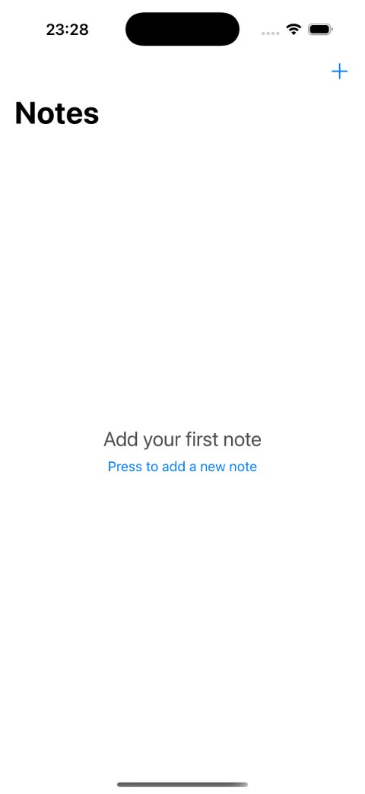

# 📝 CodeKan Notes - A Kotlin Multiplatform Simple Notes App.

**CodeKan Notes** is a modern note-taking app built with **Kotlin Multiplatform (KMP)**, delivering native performance on both Android and iOS from a single codebase. With vibrant, color-coded notes, a sleek empty-state UI, and a reactive architecture, this project showcases the power of KMP to create cross-platform apps without compromise. Packed with clean code, detailed comments, and hard-earned lessons from real-world challenges, it’s a testament to what’s possible when you push the boundaries of modern mobile development. 🚀

## 🎥 Demo Video
| Android | iOS |
|---------|-----|
|  |  |

## ✨ Features
- 📋 **Note Management**: Add, edit, delete, and list notes with ease.
- 🎨 **Color-Coded Notes**: Each note shines in yellow, blue, red, or green, creating a consistent and delightful experience across platforms.
- 📭 **Empty State UI**: A friendly prompt guides users to create their first note when the list is empty.
- ⚡ **Modern UI**: Powered by **Jetpack Compose** on Android and **SwiftUI** on iOS for fluid, native interactions.
- 🗄 **Database**: Cross-platform persistence with **SQLDelight**
- 🔄 **Reactive Data**: Driven by **Kotlin Coroutines**, `StateFlow`, and **SKIE** for `AsyncSequence` integration on iOS.
- 🧩 **Dependency Injection**: Lightweight and modular with **Koin**.
- 📝 **Clean Code**: Every line is annotated with detailed comments for clarity and maintainability.

## 📸 Screenshots
| Android | iOS | Android Empty | iOS Empty |
|---------|-----|---------------|-----------|
|  |  |  |  |

## 🚀 Getting Started

### Prerequisites
- **Kotlin**: 2.1.10
- **Android Studio**: Koala or later
- **Xcode**: 16
- **Gradle**: 8.5.2

### Installation
1. **Clone the repository**
2. **Gradle Build Project**
3. **Assemble XCFramework**\
   Run script :shared:assembleXCFramework
4. **Run androidApp on Android Emulator**
5. **Run iosApp on iOS Simulator**

## 🧰 Tech Stack
CodeKan Notes leverages cutting-edge tools to deliver a robust, cross-platform experience:
- `Kotlin Multiplatform:` Over 80% code sharing between Android and iOS, minimizing duplication while preserving native performance.
- `Jetpack Compose:` Declarative, modern UI for Android with vibrant, color-coded note cards.
- `SwiftUI:` Native iOS interface with dynamic layouts and seamless integration.
- `SQLDelight:` Type-safe SQL queries for platform-agnostic database operations.
- `SKIE:` Bridges Kotlin’s StateFlow to Swift’s AsyncSequence, enabling reactive UI updates on iOS.
- `Koin:` Lightweight dependency injection for modular, testable code.
- `Kotlinx Coroutines:` Asynchronous programming for smooth data flows.
- `Kotlinx Serialization:` Efficient data handling (used internally by SQLDelight).

## 🧠 Architecture
The app follows a clean, modular architecture:
- **Domain Layer:** Platform-agnostic business logic with NoteUseCases for add, edit, delete, and fetch operations.
- **Data Layer:** Powered by SQLDelight, managing a SQLite database with a shared schema (`NotesDatabase.sq`).
- **Presentation Layer:** Reactive ViewModels (NotesViewModel) drive the UI, with StateFlow for Android and AsyncSequence for iOS.
- **Shared Module:** The heart of KMP, hosting common logic, database, and DI setup.
- **Platform-Specific UI:** Android’s NotesScreen (`Compose`) and iOS’s NotesListView (`SwiftUI`) consume shared data while delivering native look-and-feel.
- **Code is organized into clear packages (domain, data, presentation)**, with every class and function annotated for readability. Curious? Dive into shared/src/commonMain/kotlin/com/codekan/notes/ to see the magic!

## 🧱 Challenges and Solutions
**Building a KMP app wasn’t all smooth sailing—here’s how I tackled the tough stuff:**\
**SQLite Linker Error (_sqlite3_bind_blob):**
- **Issue:** On iOS, Xcode threw an Undefined symbol: _sqlite3_bind_blob error during linking.
- **Solution:** Added libsqlite3.tbd to Xcode’s Link Binary With Libraries and ensured Podfile included pod 'SQLite3'. Also set linkSqlite = true in build.gradle.kts to explicitly link SQLite.
- **Lesson:** iOS requires explicit SQLite dependencies for SQLDelight, unlike Android’s bundled support.

**Bundle ID Warning:**
- **Issue:** Gradle warned about Cannot infer a bundle ID for iOS frameworks (shared:linkDebugFrameworkIosArm64).
- **Solution:** Added binaryOption("bundleId", "com.codekan.notes.shared") to build.gradle.kts, ensuring a unique identifier for the shared.xcframework.
- **Lesson:** KMP’s iOS framework generation needs clear bundle IDs, especially with complex dependencies.

**SKIE Integration:**
- **Issue**: Bridging Kotlin’s StateFlow to SwiftUI’s reactive model was tricky, with initial crashes in AsyncSequence iteration.
- **Solution:** Used SKIE (co.touchlab.skie:gradle-plugin:0.10.1) with FlowInterop.Enabled(true), carefully handling try await in NotesListView. Debugged lifecycle issues by ensuring viewModel.notes was properly scoped.
- **Lesson:** SKIE is a game-changer for KMP-iOS interop, but requires precise coroutine handling.

## 📫 Get in Touch
I’m passionate about building cross-platform apps with KMP, and I’m open to freelance opportunities! Whether you need a mobile app, technical consultation, or a KMP mentor, let’s talk:
- **GitHub:** [Codekan-Kt](https://github.com/codekan-kt)
- **LinkedIn:** [Efekan YILMAZ](https://www.linkedin.com/in/efekanyilmaz/)
- **Email:** efekanyilmaz.kt@gmail.com

## 🌈 Contribute
Got ideas to make CodeKan Notes even better? Open an issue, submit a pull request, or share your thoughts. Let’s build something amazing together!

## ⚙️ Acknowledgments
This is my first KMP project, and it’s been a wild ride! Huge thanks to the Kotlin, JetBrains, and Touchlab communities for their tools and inspiration. Stay tuned for more
CodeKan Labs is just the start! 

⭐ Star this repo if you found it inspiring! Let’s make cross-platform development shine!

   
